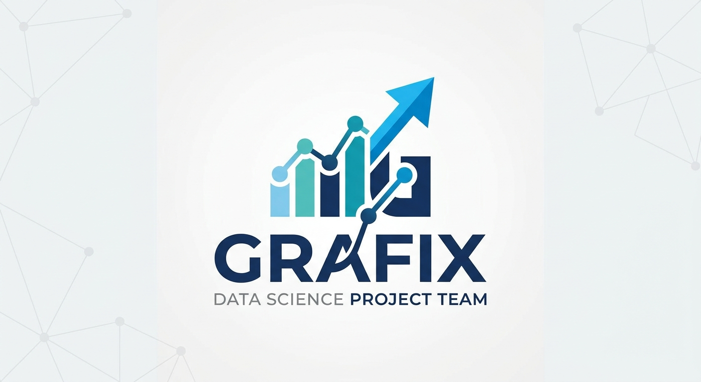

# FECAP - Fundação de Comércio Álvares Penteado

# Grafix

## Integrantes: <a href="https://github.com/Enzohenrique7">Enzo Henrique</a>, <a href="https://github.com/harryzuh">Harry Zhu</a>, <a href="https://github.com/Mura173">Murilo Ângelo</a>, <a href="https://github.com/vitorkolle">Vitor Kolle</a>

## Professores Orientadores: <a href="https://www.linkedin.com/in/eduardo-savino/">Eduardo Savino</a>, <a href="https://www.linkedin.com/in/luisspires/">Luis Pires</a>, <a href="https://www.linkedin.com/in/mauricio-lopes-42b8b33a3/">Mauricio Lopes</a>, <a href="https://www.linkedin.com/in/professorrodnil/">Rodnil da Silva</a>

## Descrição
O Grafix é uma plataforma de inteligência financeira criada para transformar grandes volumes de dados em informações claras, acessíveis e úteis para a tomada de decisão. Seu propósito é ajudar os gestores da CTI a entender melhor seu desempenho financeiro, acompanhando indicadores estratégicos em tempo real por meio de análises, relatórios e dashboards interativos publicados na nuvem.

A plataforma centraliza dados da fonte disponibilizada e realiza todo o processo de preparação das informações, desde a coleta e organização até a limpeza e integração dos dados. Dessa forma, garante maior confiabilidade nas análises e permite que as informações sejam utilizadas de forma segura, rastreável e organizada.

Além da visualização de indicadores financeiros como receita, custos, margem de lucro e ticket médio, o Grafix utiliza técnicas de estatística e ciência de dados para identificar tendências, padrões de comportamento e relações entre variáveis. Isso possibilita uma visão mais profunda do negócio, auxiliando no planejamento financeiro e na criação de estratégias mais assertivas.

Um dos principais diferenciais da solução é a capacidade de transformar dados complexos em insights fáceis de interpretar. Por meio de dashboards intuitivos, filtros dinâmicos e relatórios gerenciais, os usuários podem acompanhar a evolução dos resultados, comparar períodos e avaliar diferentes cenários de negócio, compreendendo o impacto de decisões relacionadas a custos, preços, descontos ou metas.

Mais do que uma ferramenta de análise, o Grafix busca atuar como um apoio estratégico para a gestão financeira, conectando tecnologia, dados e inteligência de negócio em uma única plataforma. O resultado é uma solução moderna, escalável e orientada a dados, capaz de transformar informações em conhecimento e conhecimento em decisões mais eficientes.

## 📄 Entregas
| **Disciplina**              | **Entrega 1**                      | **Entrega 2**                        |
|-------------------------|--------------------------------|----------------------------------|
| **Análise Inferencial de Dados**          | [Relatório da análise descritiva dos dados](./Documentos/Entrega%201/Análise%20Inferencial%20de%20Dados/Relatório%20Entrega%201.pdf)     | [xxxxxxxx](https://github.com/2026-1-NCC3/Projeto1/blob/main/Documentos/Entrega%202/An%C3%A1lise%20Descritiva%20de%20Dados) |
| **Contabilidade e Finançass**      | [Planilha CTI e Dicionário de KPIs](https://github.com/2026-2-NCC4/Projeto7/tree/f2a0d622b0f6efd93df7c3fc8dbffb6f8af1796b/Documentos/Entrega%201/Contabilidade%20e%20Finan%C3%A7as)       | [xxxxxxxx](https://github.com/2026-1-NCC3/Projeto1/blob/main/Documentos/Entrega%202/Programa%C3%A7%C3%A3o%20Orientada%20a%20Objetos%20e%20Estrutura%20de%20Dados/Entrega%202%20-%20Programa%C3%A7%C3%A3o%20Orientada%20a%20Objeto.pdf) |
| **Engenharia de Software e Arquitetura de Sistemas**      | [ES E ML ](/Documentos/Entrega%201/Engenharia%20de%20Software%20e%20Arquitetura%20de%20Sistemas/ES%20E%20ML)    | [xxxxxxxx](https://github.com/2026-1-NCC3/Projeto1/tree/main/Documentos/Entrega%202/Programa%C3%A7%C3%A3o%20para%20Dispositivos%20M%C3%B3veis)     |
| **Projeto Interdisciplinar: Ciência de Dados**| [Dashboard - Google Colab e Documentos](https://github.com/Mura173/Projeto7/tree/main/Documentos/Entrega%201/Projeto%20Interdisciplinar%20Ci%C3%AAncia%20de%20Dados)                     | [xxxxxxxx](https://github.com/2026-1-NCC3/Projeto1/blob/main/Documentos/Entrega%202/Projeto%20Interdisciplinar%20Aplicativo%20M%C3%B3vel)         |

 

## 🛠 Estrutura de pastas

-Raiz 
| 
|-->documentos 
  &emsp;|-->Entrega 1 
      &emsp;&emsp;|-->Análise Inferencial de Dados 
      &emsp;&emsp;|-->Contabilidade e Finanças 
      &emsp;&emsp;|-->Engenharia de Software e Arquitetura de Sistemas 
      &emsp;&emsp;|-->Projeto Interdisciplinar Ciência de Dados 
  &emsp;|-->Entrega 2 
      &emsp;&emsp;|-->Análise Inferencial de Dados 
      &emsp;&emsp;|-->Contabilidade e Finanças 
      &emsp;&emsp;|-->Engenharia de Software e Arquitetura de Sistemas 
      &emsp;&emsp;|-->Projeto Interdisciplinar Ciência de Dados 
|-->imagens 
|-->src 
  &emsp;|-->Entrega 1 
         &emsp;&emsp;|-->Notebook.ipynb - Google Colab 
  &emsp;|-->Entrega 2 
|readme.md 

## 💻 Configuração para Desenvolvimento
### Pré-requisitos
* Não é necessária a instalação de nehum pacote ou programa para rodar o projeto. É necessário apenas o upload da base de dados da CTI no site do Google Colab
## 📋 Licença/License
<a href="https://github.com/2026-2-NCC4/Projeto7">Grafix</a> © 2026 by <a href="https://github.com/fecaphub">Enzo Henrique Neves Sena, Harry Zhu, Murilo Angelo Pimentel Braggio, Vitor Paes Kolle, FECAP</a> is licensed under <a href="https://creativecommons.org/licenses/by/4.0/">CC BY 4.0</a>

## 🎓 Referências

- <a href="https://plotly.com/python/">Plotly</a>  

